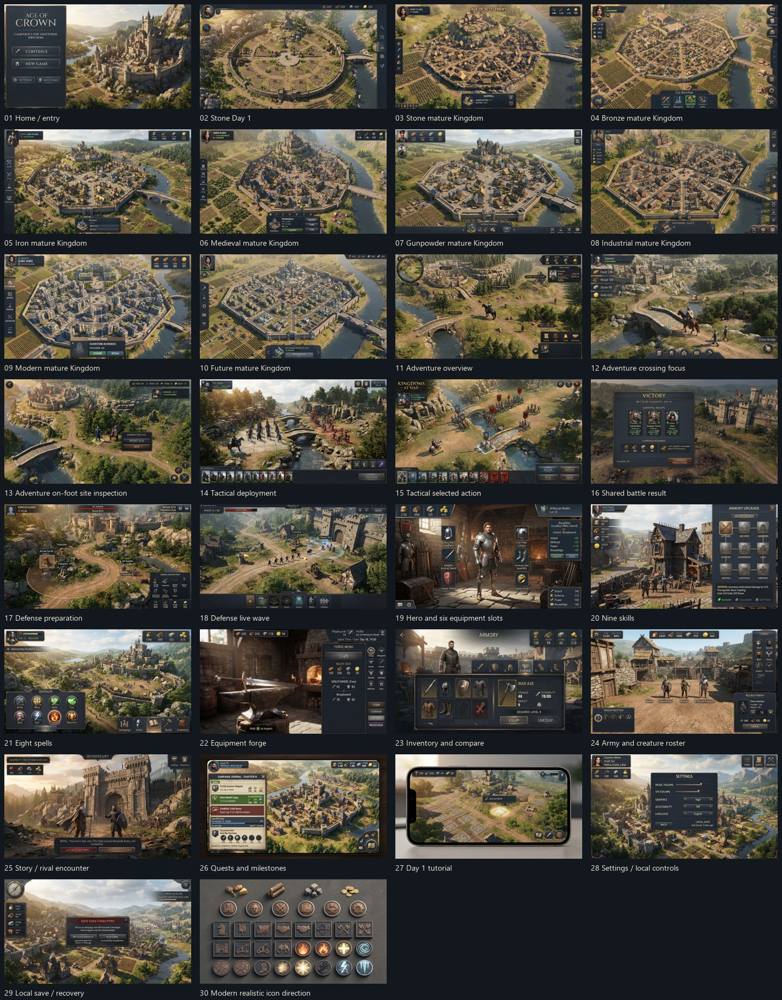

# Thirty original landscape mocks

Generated by Vertex `gemini-3.1-flash-lite-image` in one30-request batch. All30 outputs downloaded/hash-verified,1376x768. Original provider pixels preserved. Review-only appearance studies; no owner acceptance or playable game implied.

| # | Mock |
|---|---|
| 01 | [Home / entry](images/01-home.jpg) |
| 02 | [Stone Day 1](images/02-kingdom-day1.jpg) |
| 03 | [Stone mature Kingdom](images/03-kingdom-stone.jpg) |
| 04 | [Bronze mature Kingdom](images/04-kingdom-bronze.jpg) |
| 05 | [Iron mature Kingdom](images/05-kingdom-iron.jpg) |
| 06 | [Medieval mature Kingdom](images/06-kingdom-medieval.jpg) |
| 07 | [Gunpowder mature Kingdom](images/07-kingdom-gunpowder.jpg) |
| 08 | [Industrial mature Kingdom](images/08-kingdom-industrial.jpg) |
| 09 | [Modern mature Kingdom](images/09-kingdom-modern.jpg) |
| 10 | [Future mature Kingdom](images/10-kingdom-future.jpg) |
| 11 | [Adventure overview](images/11-adventure-overview.jpg) |
| 12 | [Adventure crossing focus](images/12-adventure-crossing.jpg) |
| 13 | [Adventure on-foot site inspection](images/13-adventure-foot.jpg) |
| 14 | [Tactical deployment](images/14-tactical-deployment.jpg) |
| 15 | [Tactical selected action](images/15-tactical-action.jpg) |
| 16 | [Shared battle result](images/16-battle-result.jpg) |
| 17 | [Defense preparation](images/17-defense-preparation.jpg) |
| 18 | [Defense live wave](images/18-defense-wave.jpg) |
| 19 | [Hero and six equipment slots](images/19-hero-equipment.jpg) |
| 20 | [Nine skills](images/20-skills.jpg) |
| 21 | [Eight spells](images/21-spells.jpg) |
| 22 | [Equipment forge](images/22-forge.jpg) |
| 23 | [Inventory and compare](images/23-inventory.jpg) |
| 24 | [Army and creature roster](images/24-army.jpg) |
| 25 | [Story / rival encounter](images/25-story.jpg) |
| 26 | [Quests and milestones](images/26-quests.jpg) |
| 27 | [Day 1 tutorial](images/27-tutorial.jpg) |
| 28 | [Settings / local controls](images/28-settings.jpg) |
| 29 | [Local save / recovery](images/29-save-recovery.jpg) |
| 30 | [Modern realistic icon direction](images/30-icon-material-board.jpg) |

[Recorded visual review and brief mismatches](VISUAL-REVIEW.md). All30 are original unaccepted concepts; no second batch scheduled.
