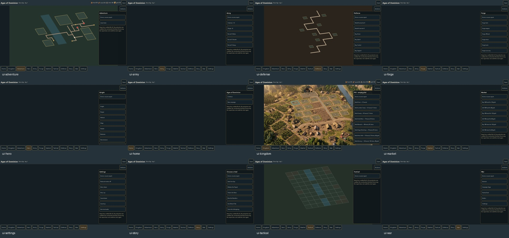

# Whole implementation and art audit — 3 October 2026

The game is **not complete against the full implementation plan**. Local collection and source integrity pass; several core systems work and 41 existing tests pass. The browser presentation, Defense engine, connected campaign journey, supporting systems, native delivery and visual acceptance remain incomplete or unverified. The owner reporting that an executor finished is not acceptance of the whole game.

This is the current planner/verifier handoff. Older audits and executor status are historical where they conflict. Give the replacement executor [the code prompt](REPLACEMENT-CODE-AI-PROMPT-2026-10-03.txt) and the image executor [the image prompt](INTERACTIVE-IMAGE-AI-PROMPT-2026-10-03.txt). The [105-item high-resolution queue](INTERACTIVE-HIGH-RES-QUEUE-2026-10-03.json) is a plan, not a submitted manifest. No executors were messaged or delegated.

## Evidence and limits

Independent evidence is in `qa/whole-implementation-audit-20261003/`: `inventory.json`, `originals.json`, `core-probes.json`, `browser-checks.json`, `tests.txt`, `alias-candidates.json`, `usage-reconciliation.json`, six source overview sheets, twelve fresh surface screenshots and four Kingdom viewport screenshots. The inventory snapshot is 2026-10-03 15:47:10 UTC. Review covered the complete spec and source files, all 510 original image thumbnails, targeted full-size images, saved manifests/gates and isolated browser/core probes. This is not a pixel-level acceptance of every image, a complete campaign playthrough, a benchmark rebuild or native/device test.

| Check | Current result | Meaning |
|---|---|---|
| Batches 01–17 | PASS locally: 30 requests/outputs each; 510 originals | Saved provider records all SUCCEEDED, all locally collected. Live provider state was not queried. |
| Original/prompt identity | PASS: 510 distinct hashes, zero source/prompt association issues | Decode/hash/prompt association, not scene or subject approval. |
| Requested identities | 504 distinct output IDs | Repeated IDs have separate preserved versions; do not overwrite or count versions as new requirements. |
| Baseline 480 inventory | 431 literal matches; 49 content-review alias candidates | Every alias has local candidate files. These are not 49 proven missing purchases or 480 accepted assets. |
| Fresh core tests | PASS: 41/41 | Limited to assertions actually exercised. Additional negative probes fail below. |
| Existing dist closure | PASS bounded: all 16 source/data and 23 referenced local asset files match | Previously missing/stale packaging findings are repaired in this snapshot. No rebuild was performed. |
| Twelve browser surfaces | PASS bounded: no page errors, failed HTTP responses or document horizontal overflow | Navigation smoke check only; many screens contain placeholders/schematic shapes. |
| Current review consumer | 510 rows; zero stale rows; 85 selected; zero runtimeApproved/ownerAccepted | Discovery is current. Scene gate is bound and FAIL. |
| Saved benchmark | STALE: 480 source rows; 627 automated PASS, one budget FAIL, eleven manual UNVERIFIED | Do not relabel as a current 510-art or visual/native PASS. |
| Native/APK/device | UNVERIFIED | No Android tree/APK identified. No build, installation or physical device testing performed. |

## Fresh defects requiring repair

1. **Roster capacity is bypassed by dwelling claims.** Fresh campaign capacity 2 already has 2 stacks. Offering/claiming Wolf creates a third stack, charges 35 gold and passes campaign validation. `src/core/campaign.js` dwelling command handling around lines 399–408 needs capacity and site/offer eligibility enforced before charging; failure must leave state unchanged.
2. **Malformed Tactical saves are accepted.** `validateBattle` accepts negative mana, an empty active queue, negative damage, zero maxCount, RNG above 32 bits and a fabricated resolved player victory with both sides alive. It also accepts a living flyer saved on blocked water, although flight does not authorize a blocked final destination. Validate domains, phase/queue/turn/effects/outcomes and campaign encounter/entity linkage. Reject corrupt transactions without minting rewards or restoring losses. Evidence: `core-probes.json`.
3. **An advertised melee action cannot execute from the UI.** A speed-5 unit at (1,3) can legally approach an enemy at (4,3) via (3,3), but the client sends forceMelee without the approach and receives “Not adjacent.” Core remote-hit rejection is now correct. The UI must preview and send the legal approach/attack transaction. Evidence: `advertisedMelee` probe; Tactical strike control in `src/client/main.js`.
4. **Home Continue loops to Home.** Rendering Home overwrites the remembered view, so Continue restores Home. Preserve the last eligible scene and pending battle/result destination. Reproduced in a fresh browser context.
5. **Starting after a damaged save does not start the clock.** Booting with `broken-save`, selecting New campaign and waiting 1200 ms leaves campaign clock unchanged. Initial timer starts only when boot already has state. Fix new/restore/recovery lifecycle with one timer and exactly-once away-credit behavior; test subsequent navigation and reload too.

Previously reported movement refill, guard bypass and illegal remote melee acceptance have bounded repairs in the current tests/source. Do not carry those old failures forward as current without a new reproduction. Positive morale remains an explicit owner-decision item in the source-equations addendum; do not invent its effect to close a checklist.

## Full-scope status against the canonical plan

| Area | Implemented foundation | Outstanding work / acceptance |
|---|---|---|
| Kingdom, eight ages | Treasury/build/production/age commands; terrain selection and picks | Finished sprites, construction/workers, perimeters, age-wide scene conversion and registered Hall/terraces/roads. Current terrain bakes plot rectangles/huts/logs. Composite FAIL. |
| Adventure | Map commands and sites; schematic road/water polygons | Generated biomes/site integration, mounted textured actors, legal path preview/confirm, shared pan/zoom/picking, committed travel and complete site encounters. |
| Tactical | Positioned seeded battle engine, move/strike/wait/defend/spells/Auto/retreat and pending settlement; isolated Skirmish | Full deployment/roster capacity, autonomous opponent turns, queue/action previews, textured formations/effects and saved battle validation. Field encounter currently uses only three allied/enemy stacks. |
| Defense | Winding lane diagram; preparation buy/retrofit | Fixed 1/60 simulation, spawn/targeting/attacks/interception/projectiles/aura, deployment, pause/2x/background behavior, waves and shared casualties/settlement. |
| Five War choices | Basic Skirmish | Campaign Siege, Tactical Duel, Endless and Challenge buttons currently produce explanatory messages. Complete declared engines and legal persistent/isolated outcomes. |
| Hero/equipment/skills/spells | Class selection, several core commands; six forge categories | Visible hero, six occupied functional slots, inventory/compare, real skill offers/points and spell eligibility/targets. Paintings alone do not implement equipment. |
| Army/Forge/Market | Basic text transactions | Complete unlocked/disabled states, capacity/quantity/stats/rank/quality/cost presentation, neutral creatures/Codex and item integration. |
| Story/quests/tutorial/Future | Rival selector and brief text | Frozen seven chapters plus authored Future conclusion, branch/milestone/claim persistence, six quests and command-anchored tutorial. |
| Save/navigation/audio/settings | Local saves and core navigation; independent audio buses and beep SFX | Fresh defects above; real local music source and full settings/help/credits/privacy. No haptics under zero-permission policy. |
| Native/offline/performance | Browser packaging closure | Static zero-permission Android package, APK validation, lifecycle/native/device/performance evidence in separate gates. Device testing remains stopped unless owner renews it. |

All eight ages, three modes, eight classes, six gear slots and connected campaign remain requirements. Independently author code; old game and raw art are read-only references. No cloud gameplay, accounts, store publishing or runtime network permissions.

## Visual and registration review

The approved landscape mock direction is richer, readable, inhabited scene art. Fresh Adventure/Tactical/Defense screenshots remain diagrammatic; Hero/Army/Forge/Market are largely blank stages with text controls. This is visual FAIL against that direction, even though smoke navigation passes. Approved mocks are appearance references with documented synchronization/era/name defects; do not adopt their invented statistics, medieval Stone elements or rival/equipment names as rules.

Kingdom chrome is currently 56 px header plus 56 px footer. At 825×375 and 933×424, contained terrain occupies only about 57.1% and 59.9% of stage width before the action panel: FAIL against the >=80% unoccluded overview requirement. Checks also captured 1180×820 and 1280×720. Compact safe-area edge HUD and a coordinated camera/layout proposal are needed; all terrain/actors/routes/hit regions must share the same transform. No independent crop, roof shrink or layer warp to hide overlap.

Latest candidate v2 has a better measured Hall threshold/stone foot, but inferred rear corners and a rectangle terrace remain incomplete physical registration. Uniform .34 roof envelope fits the frame; that alone is not a scene PASS. Candidate records 12 blocking door occlusions and 9 acceptable envelope overlaps, and tablet P11 partly lies under the panel. Real isolated Stone sprites are absent. Review chrome 92 px differs from runtime 112 px. Candidate/guide status remains NOT_OWNER_ACCEPTED; live scale .1312 is unchanged.

Batch14 `kingdom-stone-day1-composition-v4` (SHA256 `5dfdc20e8724acf48781ceae15d00a35899c855a26408a8e7656f84165f23c76`) is preserved useful art reference: thatched Hall, full roof and natural landscape improve. River/crossing/site geometry differs from the candidate and its Hall differs from Hall v3. No proof of 17 playable clearings. Spatial FAIL; do not flatten this painting into a playable approved scene. Input/recovery/new v5 guides remain NOT_OWNER_ACCEPTED. Hall v3 (SHA256 `f359a8b72100be8ad78eaf61eede19bc8b2db3bd0a1d071050a51edce22cc37c`) retains a native pink-warning issue.

Keep five bounded UI art passes: Food/Wood/Stone at 18 px, Gold v3 at intended small size, Offense at 36/64 px. They do not approve the entire atlas, mattes, animation or runtime.

## Art recovery and identity

All 510 originals received overview inspection; selected problem/corrected sources were inspected full size. Use originals, clean derivatives and existing high-resolution outputs first. Preserve rejected candidates and exact provenance. Overview review does not resolve all alpha fringes, rig slices, light/depth/pivot registration or mechanism details.

Batch17 corrected Bronze/Iron/Gunpowder/Industrial/Modern/Future heavy forms are useful candidates but use `attacker-AGE-heavy`, whereas army canonical identity is `troop-AGE-heavy`. Do not substitute these for the five siege-attacker roles. Review content and record aliases explicitly. Iron Splash is now a non-gunpowder wooden throwing mechanism; exact Onager mechanism remains UNVERIFIED.

Examples requiring recovery/content review: production02 Ancient Warlock portrait is an aerial settlement; production17 motor saddle/harness is terrain; Cave Bear is a landscape/composited bear rather than an isolated creature; production03 Stone weapon is terrain while an earlier correct flint weapon exists. Spell sheets contain tiny baked labels and require useful-part extraction review. These failures do not authorize purchases outside the selected high-resolution queue.

The 49 alias candidates cover six sites, six artifacts, ten effects, three mounts, eight rigs, six rivals, eight chapter images and two supporting materials. Rival image names Aldric/Corvus/Kane/Morgana/Theron/Valeria are appearance candidates only. Frozen game names remain Varek Iron-Eye, Malakor the Flayed, Thalric Ash-Bane, Bran the Relentless, Karn Blood-Tide and Soren the Unforgiving. The 128 generated gear IDs are a selected identity inventory, not 8×4×6 (which is 192).

## Individual high-resolution work and budget

Owner selected **32 individual native 4K terrain images first**, then **73 native 2K images in later groups**. The canonical selection retains the other 375 baseline positions at 1K. First 32 are eight Kingdom ages plus eight terrain/biome variants each for Adventure, Tactical and Defense. Later proposal: A=32 hero paintings, B=17 mounts/rigs/rivals, C=24 army roles. Group order is a proposal; activate later groups through owner scheduling after the 4K report. No batch18+, pilot, filler, supplemental calls or automatic retry.

Current official standard pricing for `gemini-3.1-flash-image`: $0.50/M input, $60/M image output, $3/M text output; 4K output uses 2520 image tokens and 2K 1680. Thus 32×4K image output alone is $4.8384 and 73×2K $7.3584. Inputs/text/storage/tax are additional. Use native requested imageSize, decode actual dimensions and preserve the logical aspect/camera; do not promise a guessed 3840×2160 file or label upscaling as model-native 4K. Sources: [Google pricing](https://cloud.google.com/gemini-enterprise-agent-platform/generative-ai/pricing), [model capabilities](https://docs.cloud.google.com/gemini-enterprise-agent-platform/models/gemini/3-1-flash-image), [image edit API](https://docs.cloud.google.com/gemini-enterprise-agent-platform/models/capabilities/gemini-edit-images).

Independent sums from saved 510 collection usage records: 985,482 input and 574,764 candidate-output tokens. Pricing all candidate output at standard image price gives $34.978581; producer's rounded 15% overhead + $2 mock + protected $15 reserve reconciles to **$57.225 protected exposure**. Invoice total remains UNKNOWN. This is a conservative evidence-bound accounting value, not billed spend or a guarantee that storage/tax is fully covered.

Historical seventeen $6 holds + mock/reserve sum $119 and remain preserved. Consumer benchmark incorrectly continues treating retained holds as current exposure while producer now has reconciliation evidence. Executors must fix schema/consumer accounting against evidence without deleting historical reservations, treating unknown invoices as zero or relaxing $80 hard cap/$15 reserve.

Queue proposes per-call caps of 4096 output tokens for 4K, 2048 for later 2K, <=4000 input tokens (reference images/text counted), and 15% overhead. If current provider accepts/supports these caps and all liabilities are reconciled, pricing ALL capped output as images protects total105 exposure at approximately **$76.826244**, including the existing $57.225. This is conditional and exceeds the $60 aim, with only about $3.17 below $80. The first32 already exceed the $60 aim under the expected-output estimate. Executor must establish real affordability/reservations before calls and stop if it cannot; no expanded budget is implied. Reserve15 is never available for generation.

Saved batch17 lock is TERMINAL_COLLECTED, last checked/collected 15:25:06 UTC. Live remote/shared mutex state is UNKNOWN to this planner. Image executor must reconcile global/US-Central1 listings and local/cloud locks before individual calls. Maintain one active/unknown operation across sessions in the supplied project. Stop on quota/429, ambiguous response or billing failure; retain UNKNOWN and do not resubmit.

## Git and preservation

Owner supplied destination [ages-of-dominion-reborn](https://github.com/arghaG123/ages-of-dominion-reborn), with commit/push **after the replacement code AI completes its next task**. Local branch is `codex/rebuild`, with no commits, tracked files or remote. `.gitignore` does not yet exclude assets. No Git mutation, upload, move, deletion or backup was performed here.

All `assets/` stays outside Git. Before ignore/staging, executor must preserve originals/raw responses/derivatives/guides/rejected versions and needed evidence in an explicit archive plus independent durable copy, verify hashes and a clean restore, then commit a sanitized pinned restore manifest/recipe. Destinations for those two copies are still missing; the supplied GitHub URL resolves only the Git destination. Do not infer a local duplicate or provider output bucket meets backup requirements. Classify unique QA/preview/reference evidence explicitly rather than blanket-ignoring it. Never stage embedded raw payloads/secrets, blindly run git add ., overwrite existing remote history or force push. Detailed order is in the code prompt and existing storage plan.

## Work performed by this planner

Read-only production/source review, fresh tests and isolated browser/core probes; new QA diagnostics/screenshots, this report, queue and two prompts; documentation pointers. No game repairs, build, native/device testing, paid generation, remote provider query, collection, production/guide/lock/budget edits, executor delegation/messages, Git mutation or asset move/delete. PASS, FAIL, UNKNOWN and UNVERIFIED remain separate from owner approval.
